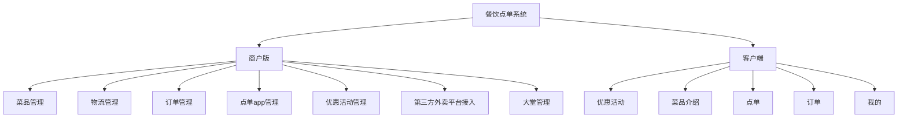
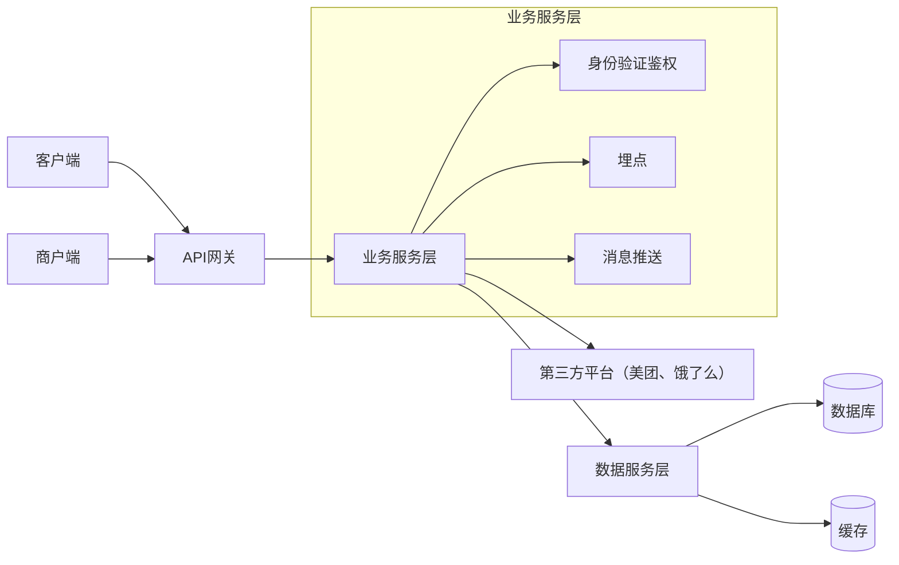
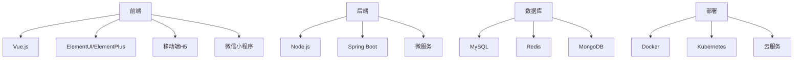
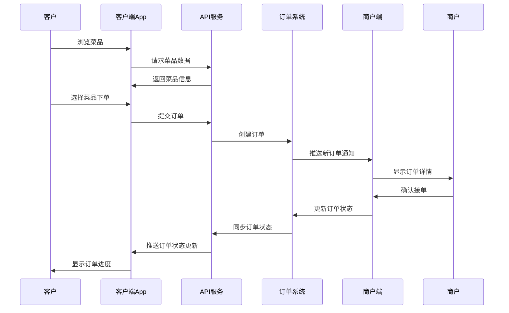

# 餐饮点单系统产品架构

## 1. 产品概述

餐饮点单系统是一个面向餐饮行业的综合解决方案，旨在优化餐厅运营和提升用户体验。该系统分为商户版和客户端两大核心组件，覆盖从菜品管理、订单处理到客户服务的全流程。

## 2. 产品组件概览

## 3. 功能详情

### 3.1 商户版

#### 菜品管理
- 菜品创建、编辑、下架
- 菜品分类与标签管理
- 菜品图片上传与管理
- 价格与库存管理
- 特殊要求配置（辣度、配料等）

#### 物流管理
- 配送路线规划
- 骑手管理与分配
- 配送状态实时追踪
- 配送统计与分析

#### 订单管理
- 订单接收与处理
- 订单状态追踪
- 订单统计与报表
- 异常订单处理

#### 点单app管理
- 应用配置管理
- 界面布局自定义
- 功能模块开关
- 版本更新管理

#### 优惠活动管理
- 满减、折扣活动创建
- 优惠券管理
- 会员特价设置
- 活动数据分析

#### 第三方外卖平台接入
- 美团、饿了么等平台对接
- 订单同步管理
- 菜品信息同步
- 多平台数据整合

#### 大堂管理
- 桌位管理
- 排队叫号系统
- 堂食订单管理
- 包间预订管理

### 3.2 客户端

#### 优惠活动
- 优惠信息展示
- 优惠券领取与使用
- 会员专享活动
- 节日特惠活动

#### 菜品介绍
- 分类浏览菜品
- 菜品详情展示
- 菜品评价与评分
- 推荐菜品展示

#### 点单
- 在线点餐
- 购物车管理
- 特殊要求定制
- 支付方式选择

#### 订单
- 订单创建与支付
- 订单状态追踪
- 历史订单查询
- 订单评价

#### 我的
- 个人信息管理
- 收货地址管理
- 支付方式管理
- 消费记录查询

## 4. 软件架构

### 4.1 系统架构图

### 4.2 技术架构

### 4.3 数据流程

## 5. 未来规划

- 接入AI推荐系统，提供个性化点餐体验
- 增加会员积分系统，提升客户粘性
- 开发数据分析平台，提供经营决策支持
- 完善多语言支持，拓展国际市场
- 增强与智能厨房设备的互联互通
